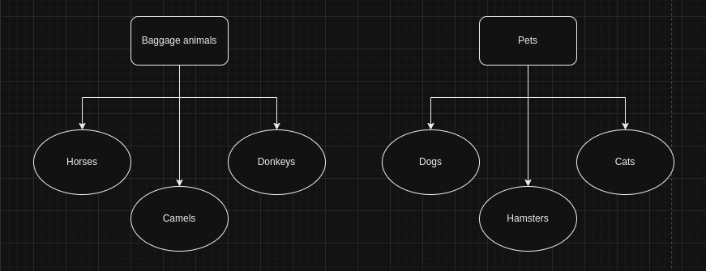

# Дисклеймер

*Компьютер с ubuntu без русской раскладки, не ругайте за то, что не следую ТЗ, я перевожу дословно =Ъ*

*Часть с кодом выполнял на другом компьютере, где русская раскладка уже была, комментарии внутри кода могут быть на русском.*

*Перед тем, как приступил к написанию кода принял все изменения веток на гитхабе, клонировал репозиторий, программа пишется в той же папке.*

# Задание 1.

*На рабочем столе создана папка Attestation.*
*Заходим в терминал ubuntu.*
*Переходим в папку:*
**cd Desktop/Attestation**
*В задании сказано создавать через cat, однако потом необходимо заполнять файлы. На данном этапе значений немного, использую echo:*

**echo  "dogs"  >  "pets"
echo  "cats" >> "pets"
echo "hamsters" >> "pets"**

**echo "horses" > "baggage animals"
echo "camels" >> " baggage animals "
echo "donkeys" >> " baggage animals "**

*объединяем файлы через cat:*
**cat  " pets "  " baggage animals "  >  "friends of humankind"**

*Смотрим, что внутри*

**cat  " friends of humankind "**

*Переименовываем:*

mv " friends of humankind " " friends_of_humankind "
# Задание 2.

*в той же папке Attestation создаю новую директорию Friends:*

**mkdir Friends**

*переносим файл:*

**mv friends_of_humankind Friends/**

# Задание 3.

*Чтобы установить  репозиторий MySQL надо бы сначала узнать версию ubuntu
В терминале вводим:*

**lsb_release -a**

*установлена версия jammy.*

**sudo add-apt-repository 'deb http://repo.mysql.com/apt/ubuntu/ jammy mysql-8.0'**

*вводим пароль моего системного юзера, нажимаем enter*

*устанавливаем mysql server*

**sudo apt install mysql-server**

*пароль для root установить не предлагали*

**mysql -u root**

*и всё умерло. 1698 ошибка*

*обошёл через два часа попыток, переустановки, запуски в безопасном режиме с попыткой заменить пароль, а сработал гугл и:*

**sudo mysql -u root ALTER USER 'root'@'localhost' IDENTIFIED WITH mysql_native_password BY 'test';**

# Задание 4.
*Установить и удалить deb пакет. Ну какой и зачем это делать мне пока не ясно, но допустим будет htop*

**sudo apt-get download htop
sudo dpkg -i htop_*.deb
sudo dpkg -r htop**

*просто потому что нам не жалко насиловать HDD после того, что с ним было при переустановках MySQL*

# Задание 5.

*Ну тут просто ввожу* **history**, *копирую всё, что наделал до текущего момента в odt файл, также в репозитории.*

# Задание 6.
*Ну draw.io, полагаю, для диаграммы*

 

# Задание 7.

*Залетаем в mysql*
**sudo mysql -u root** *(пароль при установке не запрашивал)*

**CREATE DATABASE Friends;**

*Проверяем её наличие*

**SHOW DATABASES;**

# Задание 8.

*Чтобы что-то создавать где нужно, сначала переходим в нужную б.д.*

**USE Friends;**

**CREATE TABLE pets (
    id INT PRIMARY KEY AUTO_INCREMENT,
    type VARCHAR(50) NOT NULL
);**

**CREATE TABLE baggage_animals (
    id INT PRIMARY KEY AUTO_INCREMENT,
    type VARCHAR(50) NOT NULL
);**

*Проверяем*

**SHOW TABLES;**

*вставляем типы животных*

**INSERT INTO pets (type) VALUES ('dog');
INSERT INTO pets (type) VALUES ('cat');
INSERT INTO pets (type) VALUES ('hamster');**

**INSERT INTO baggage_animals (type) VALUES ('horse');
INSERT INTO baggage_animals (type) VALUES ('camel');
INSERT INTO baggage_animals (type) VALUES ('donkey');**

# Задание 9.

*Нужны новые столбцы под имена, даты рождения и команды*

**ALTER TABLE pets
ADD COLUMN name VARCHAR(100),
ADD COLUMN birth_date DATE,
ADD COLUMN commands VARCHAR(255);**

**ALTER TABLE baggage_animals
ADD COLUMN name VARCHAR(100),
ADD COLUMN birth_date DATE,
ADD COLUMN commands VARCHAR(255);**

*Вносим данные*

**INSERT INTO pets (type, name, birth_date, commands) VALUES 
    ('dog', 'Sirius', '2018-04-15', 'sit, fetch, guard'),
    ('dog', 'Fang', '2019-07-28', 'sit, fetch, roll over'),
    ('dog', 'Snuffles', '2020-09-10', 'sit, fetch, bark'),
    ('cat', 'Crookshanks', '2019-02-10', 'meow, purr, play'),
    ('cat', 'Mrs. Norris', '2020-05-20', 'meow, watch, patrol'),
    ('cat', 'Whiskers', '2021-08-05', 'meow, sleep, eat'),
    ('hamster', 'Pigwidgeon', '2020-03-15', 'run in wheel, eat, sleep'),
    ('hamster', 'Scabbers', '2019-11-20', 'run in wheel, hide, chew'),
    ('hamster', 'Nibbles', '2022-01-10', 'run in wheel, explore, nibble');**

**INSERT INTO baggage_animals (type, name, birth_date, commands) VALUES 
    ('horse', 'Gurney', '2017-06-20', 'gallop, neigh, trot'),
    ('horse', 'Shadowfax', '2018-08-15', 'gallop, whinny, jump'),
    ('horse', 'Rakian', '2019-09-30', 'gallop, snort, rear'),
    ('camel', 'Malfoy', '2018-04-10', 'walk, spit, chew'),
    ('camel', 'Al-Qadi', '2019-05-25', 'walk, grunt, carry'),
    ('camel', 'Arrakis', '2020-07-12', 'walk, moan, haul'),
    ('donkey', 'Harkonnen', '2019-02-05', 'bray, kick, carry'),
    ('donkey', 'Shai-Hulud', '2020-03-18', 'bray, graze, pull'),
    ('donkey', 'Atreides', '2021-09-01', 'bray, nuzzle, transport');**

*Данные внесены, но с прошлого задания есть пустые экземпляры, чистим.*

**DELETE FROM pets WHERE birth_date IS NULL;**

**DELETE FROM baggage_animals WHERE birth_date IS NULL;**

# Задание 10.

*Тут я понял, что про иерархию понял не так, и нужно было делать таблицу на каждый тип животного. Но т.к. уже есть почти то, что нам нужно, просто удаляем верблюдов, а на JOIN еще будет задача.*

*Удаление горбатых:*

**DELETE FROM baggage_animals WHERE type = 'camel';**

# Задание 11.

*Перевозим молодняк. Сначала делаем под них таблицу.*

**CREATE TABLE young_animals (
    animal_id INT AUTO_INCREMENT PRIMARY KEY,
    animal_type VARCHAR(50),
    name VARCHAR(50),
    birth_date DATE,
    age_months INT
);**

*И заполняем*

**INSERT INTO young_animals (animal_type, name, birth_date, age_months)
SELECT 
    type,
    name,
    birth_date,
    TIMESTAMPDIFF(MONTH, birth_date, NOW()) AS age_months
FROM
    pets
WHERE
    TIMESTAMPDIFF(YEAR, birth_date, NOW()) BETWEEN 1 AND 3;**

**INSERT INTO young_animals (animal_type, name, birth_date, age_months)
SELECT 
    type,
    name,
    birth_date,
    TIMESTAMPDIFF(MONTH, birth_date, NOW()) AS age_months
FROM
    baggage_animals
WHERE
    TIMESTAMPDIFF(YEAR, birth_date, NOW()) BETWEEN 1 AND 3;**

# Задание 12.

*Собираем сначала данные из питомцев и вьючных в единую таблицу*

**CREATE TABLE all_animals AS
(
    SELECT
        'pet' AS category,
        id AS animal_id,
        type AS animal_type,
        name,
        birth_date,
        NULL AS age_months
    FROM
        pets
    UNION ALL
    SELECT
        'baggage_animal' AS category,
        id AS animal_id,
        type AS animal_type,
        name,
        birth_date,
        NULL AS age_months
    FROM
        baggage_animals
);**

*По молодым, смог «подтянуть» данные, но столбец выдал NULL во всех экземплярах.*

**INSERT INTO all_animals (category, animal_id, animal_type, name, birth_date, age_months)
SELECT
    'young_animal' AS category,
    NULL AS animal_id,  
    young_animals.animal_type,
    young_animals.name,
    young_animals.birth_date,
    young_animals.age_months
FROM
    young_animals
LEFT JOIN
    all_animals ON young_animals.name = all_animals.name AND young_animals.birth_date = all_animals.birth_date
WHERE
    all_animals.name IS NULL;**

# Итоги по ubuntu+SQL
*Нужно было изначально пытаться работать со связными ID, наверное, я пытался, даже, но не справился. Отдельно добавлю, что было интересно работать через оболочку в терминале, а не php зоне. Отдельно использовал там команды для переключения БД на Friends через USE, смотрел таблицы через SHOW TABLES, и их содержание через SELECT*FROM. Вообще непривычно, после десктопного workbench, но интересный опыт.*

*Хотел выгрузить таблицы в csv, но mysql работал через secure_file_priv, около двух часов пытался побороть, в том числе через предоставление всех привилегий и через отключение режима командой, искал строку в файле настроек, где до этого безуспешно пытался менять директорию. Идея была следующая, я создал уже 4 файла в нужной директории через touch, и есть команда для экспорта данных в конкретные файлы, но инициативой был наказан, глубокое разочарование в 6 утра.*

*Далее, GIT. На каждом этапе, где менялся файл из директории, создавалась новая ветка репозитория, и заливалась на github. Не видел смысла в pull request до того, как не закончу и не перейду на основной комп. 
Создан один пул pull request по последней ветке, т.к. в каждой коммитил через ‘add .’
Перехожу в python, далее все комментарии будут в нем.*

